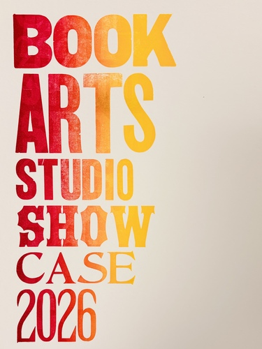
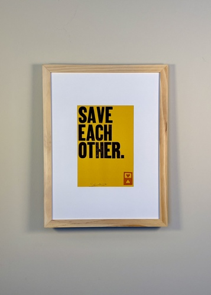
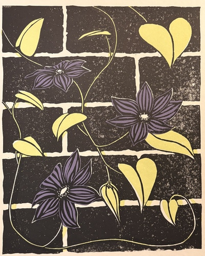
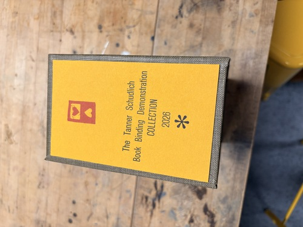
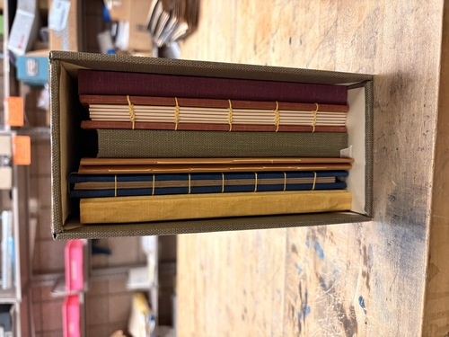
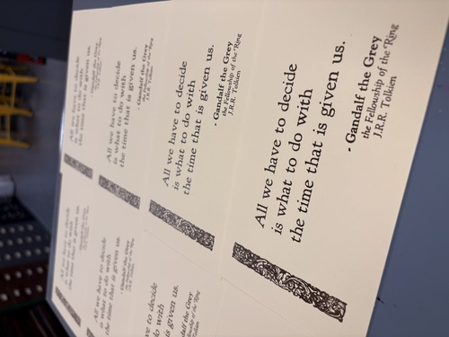
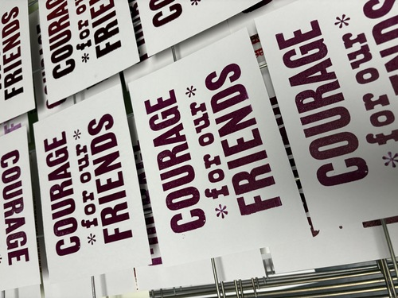
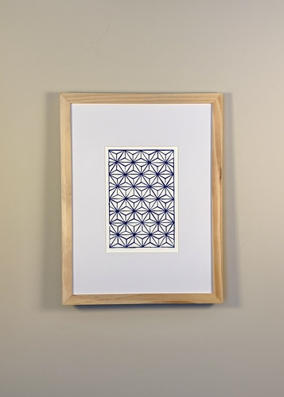
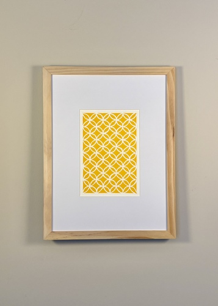

# 

# Portfolio

## Visit Stout Heart Press on Etsy

Stout Heart Press Shop

## *2026 U-M Book Arts Studio Showcase*, 2026

*Letterpress, Rubber-based ink on paper*

Split-fountain signage advertising the 2026 Book Arts Studio Showcase at the Univeristy of Michigan Book Arts Studio. This exhibit highlighted work created in the studio by community members over the 2025-2026 academic year. 

***

## *Signs of the Times* Series

### *Save Each Other.*, 2026

*Letterpress, Rubber-based ink on paper*

*[Edition of 17]*

This print is a part of the *Signs of the Times* series, which is inspired by the simple boldness of protest signs bearing messages for any historical moment. Wood type for this print was sourced from the University of Michigan Book Arts Studio collection.

***

## *Clematis*, 2026

*Multiblock Linocut, Oil-based ink on paper*

*[Open Edition]*

Inspired by the clematis growing along the side of my grandmother's house. She enjoyed viewing them from the couch in her den. I began carving these blocks on what would have been her 86th birthday.

***

## *Book Binding Demonstration Collection*, 2026

A collection of seven different hand bound books featuring a different binding structure each. Structures include: Pamphlet Stitch, Saddle Stitch, Stiffened Board, Sewn Board, Case Binding, Coptic Stitch, Stab Binding.

***

## *Lord of the Rings* Series

### *The Time That is Given Us*, 2025

*Letterpress, Rubber-based ink on paper*

Inspired by the words of Gandalf to Frodo in *the Fellowship of the Ring* by J.R.R. Tolkien.

### *Courage for our Friends*, 2025

*Letterpress, Rubber-based ink on paper*

Inspired by the words of Eowyn to Merry in Peter Jackson's film *Lord of the Rings: Return of the King*.

***

## *Sashiko-Inspired* Series

A series of linocut prints inspired by my personal experiences learning the Japanese embroidery technique of *sashiko*.

### *Asanoha Pattern*, 2025

*Linocut, Rubber-based ink on paper*

A mounted linocut block with a hand-drafted *asanoha* (hemp leaf) inspired motif.

### *Shippo-tsunagi Pattern*, 2026

*Linocut, Rubber-based ink on paper*

A mounted linocut block with a hand-drafted *shippo-tsunagi* (Seven Treasures) inspired motif.