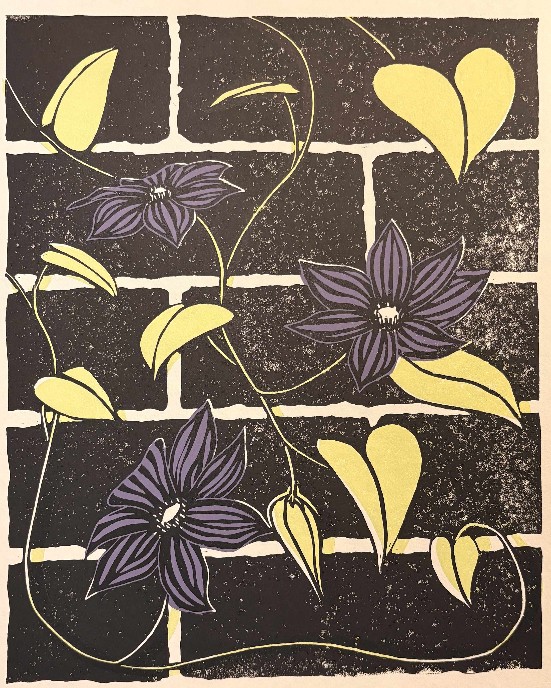

# 

# Portfolio

## *Interested in purchasing a print? Visit Stout Heart Press on Etsy*

Stout Heart Press Shop

## *Signs of the Times* Series

### *Save Each Other.*

*Letterpress, Rubber-based ink on paper*

This print is a part of the *Signs of the Times* series, which is inspired by the simple boldness of protest signs bearing messages for any historical moment. Wood type for this print was sourced from the University of Michigan Book Arts Studio collection.

***

## *Clematis*

*Multiblock Linocut, Oil-based ink on paper*

Inspired by the clematis growing along the side of my grandmother's house. She enjoyed viewing them from the couch in her den. I began carving these blocks on what would have been her 86th birthday.